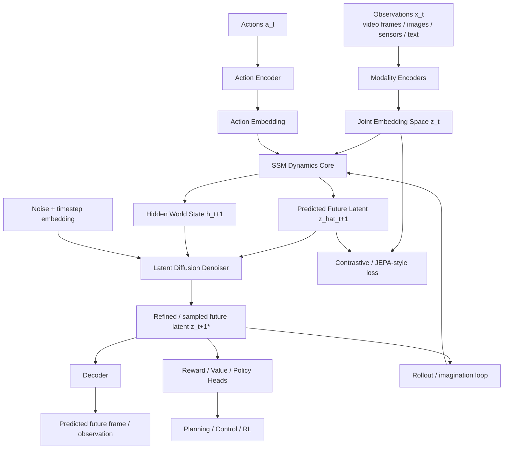
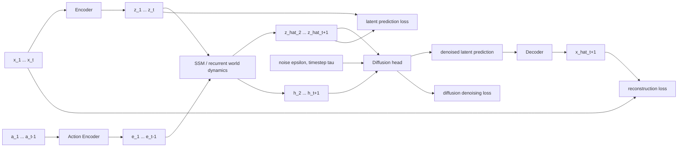
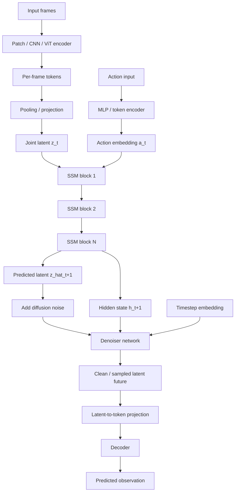
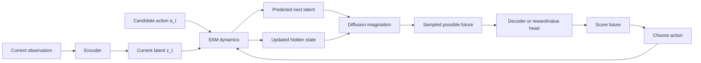

# Model Architecture Diagrams

## High-level architecture

## Training-time internal view

## Module-by-module breakdown

## Inference / imagination loop

## Equation summary

\[
z_t = E(x_t)
\]

\[
h_{t+1}, \hat z_{t+1} = f_{\text{SSM}}(h_t, z_t, a_t)
\]

\[
z_{t+1}^{*} = f_{\text{diffusion}}(\hat z_{t+1}, h_{t+1}, \tau, \epsilon)
\]

\[
\hat x_{t+1} = D(z_{t+1}^{*})
\]
